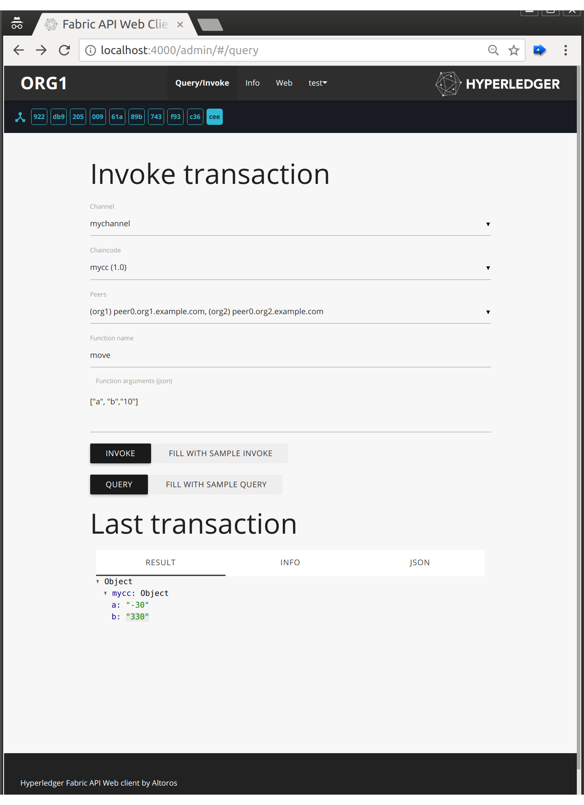
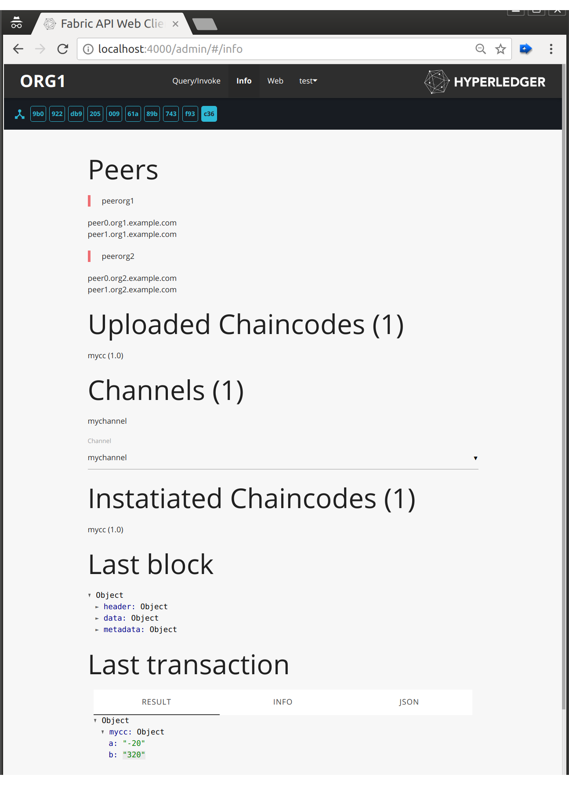

# REST API server for Hyperledger Fabric 1.x

This server provides a convenient REST interface for web applications to transact on 
[Hyperledger Fabric 1.x](https://github.com/hyperledger/fabric) network. 
It uses [Node.js SDK](https://github.com/hyperledger/fabric-sdk-node) API to call peers, orderer and CA servers of 
network's members.

The server can be instantiated from a [docker image](https://hub.docker.com/r/dockeraltoros/fabric-rest) and run alongside
other services like peers and ca servers on a member's host.
 
## REST Server

The API server is meant to be run by each member organization. It manages user authentication, interacts with peers and
passes events to the client.

See the example calls in [REST.md](REST.md).

### Authentication

The server connects to the organization's CA server to get certs for end users and passes these certs to authenticate 
to blockchain peers. User requests coming from a web app authenticate with a Bearer JWT token for which the server 
finds a corresponding key cached locally and signs user transactions with it when it passes them to peers.

To enable pre-auth feature, please add `index.js` file to `server/middleware-auth` folder. Example can be found below:
```js
//3rd-party auth-store
const credentials = [{
  username: 'test',
  password: undefined,
  org: 'a'
}];

module.exports = function auth(username, password, orgname) {
  const user = credentials.find(obj => obj.username === username && obj.org === orgname && obj.password === password);
  return user ? Promise.resolve(user) : Promise.reject({status: 401, message: 'invalid credentials'});
};
```

### Events

Block events coming from peers are sent to clients with a popular [socket.io](https://socket.io/) library to be consumed 
by browser or other clients.

## Admin Web Application 

Admin web application is served from the http endpoint for developers to invoke chaincodes and view transaction and 
block info. Please note that connection to the API server and the test web app is not password protected.

 

## Network
 
Please use [Fabric-Starter](https://github.com/Altoros/fabric-starter) for the network setup.

## Config

Environment
-----------

* `PORT` - api/web interface port (default is `4000`)
* `ORG` - organization id. No default value, you have to set it explicitly
* `CONFIG_FILE` - ledger config file (default is `../artifacts/network-config.json`)
* `WEB_DIR` - location of web application (default is `www`)
* `MIDDLEWARE_CONFIG_FILE` - middleware map file (default is `./middleware/map.json`)


Launch
------
Api web-interface become available on `http://localhost:4000` after launching:

```
  npm install
  ORG=org1 npm start
  # or: ORG=org2 npm start
```


Known issues
------------

* peer ID should be started with 'peer' word (specified in `network-config.json`).  
  
  RIGHT:
```
   ...
        "org1": {
			...
			"peer1": { ... },
			"peer2.example.com": { ... },
			"peer": { ... },
		},
   ...
```

  WRONG:
```
   ...
        "org1": {
			...
			"n1.peer": { ... },
			"host2.example.com": { ... },
		},
   ...
```

* orderer should be named `"orderer"`. No options, you cannot rename it.

* endpoints `/channels/<channelName>/config` and `/genesis` are not work properly

* chaincode instantiate works with `peer1` exactly. no options here

* admin UI uses `peer1` to get common info